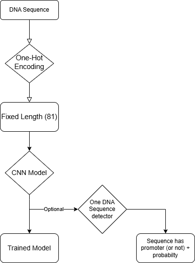

# ANN-Project
# 🧬 Promoter Sequence Classification Using CNN

## 📌 Project Overview

This project focuses on building a Convolutional Neural Network (CNN) to classify DNA sequences as **promoter** or **non-promoter regions**. Promoter regions are important parts of DNA that help initiate gene transcription.

The goal of this project was to design, train, and evaluate a deep learning model capable of identifying promoter sequences from raw DNA data.

---

## 🧠 System Architecture

The system follows a complete machine learning pipeline:

1. **Raw DNA Sequences**
   - Input data consists of nucleotide sequences (A, C, G, T)

2. **Preprocessing**
   - One-hot encoding of nucleotides
   - Standardization of sequence length (padding/truncation)

3. **Neural Network Model (CNN)**
   - Convolutional layers for pattern/motif detection
   - Pooling layers for dimensionality reduction
   - Dropout layers for regularization
   - Fully connected dense layers for classification

4. **Output Layer**
   - Sigmoid activation function
   - Produces probability of promoter vs non-promoter

5. **Prediction**
   - Threshold-based classification (0.5 cutoff)

---

## 🔄 Data Flow Diagram

## 🧪 Training Process

The model was trained using multiple experimental iterations:

| Attempt | Dataset Split | Architecture | Performance | Notes |
|--------|--------------|--------------|-------------|------|
| 1 | 80/20 | Basic CNN | 68% accuracy | Baseline after dataset correction |
| 2 | 80/20 | +1 Conv layer | 75% accuracy | Improved feature extraction |
| 3 | 80/20 | Increased dropout tuning | ~76% accuracy | Minor improvement |
| 4 | 80/20 | >4 Conv layers | Lower accuracy | Overfitting observed |

---

## 📊 Performance Metrics

- Accuracy: ~75–76% (best model)
- Loss: decreased over training epochs
- Evaluation metrics: accuracy, validation accuracy

---

## ⚙️ Key Improvements Tested

- Adding convolutional layers
- Adjusting kernel and filter sizes
- Modifying dropout rate (0.4 → 0.12)
- Experimenting with network depth

---

## ⚠️ Challenges

- Initial dataset produced misleadingly high accuracy (99.4%)
- After correction, performance dropped significantly (realistic evaluation)
- Model tuning became trial-and-error based
- Technical issues slowed development (hardware limitations)

---

## 📚 Key Learnings

- Dataset quality has a major impact on model performance
- CNNs are highly sensitive to architecture changes
- More complexity does not always improve results
- Machine learning requires iterative experimentation and analysis

---

## 🚀 Conclusion

This project demonstrated the process of building and refining a deep learning model for biological sequence classification. While initial results were misleading due to dataset issues, systematic debugging and experimentation led to a more accurate and reliable model.

---

## 👨‍💻 Authors

Team Project – Neural Network Classification of DNA Sequences
Mahmoud Leghlimi and Magnus McCaslin